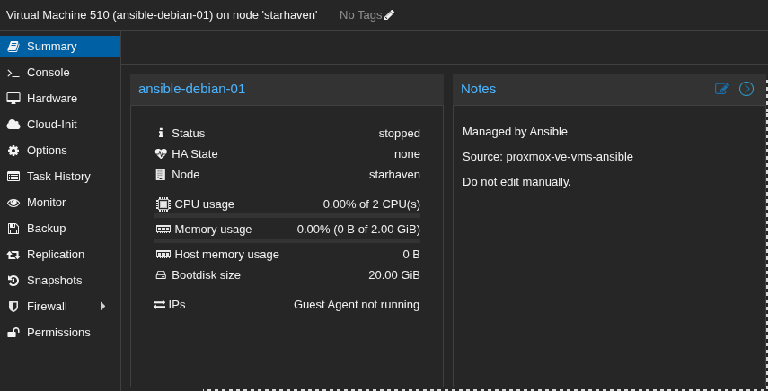

# Documentation Screenshots

Screenshots showing the system working end-to-end, for use in the writeup.

## proxmox-vm-notes-field.png


**What it shows:** Proxmox web UI summary page for VM 510 (ansible-debian-01) on node 'starhaven'.
The Notes field on the right confirms the `description` field set by `create-vm-from-iso-proxmox.yml` is
visible in the Proxmox UI:

> Managed by Ansible Source: proxmox-ve-vms-ansible
> Do not edit manually.

**Context:** Taken after running:
```
ansible-playbook -i inventory/hosts.ini create-vm-from-iso-proxmox.yml \
  --tags "createVMs,createDisks,mountIso,bootOrder"
```

VM is in 'stopped' state, 2 CPU, 2 GiB RAM, 20 GiB boot disk, Guest Agent not yet running (VM not started).
